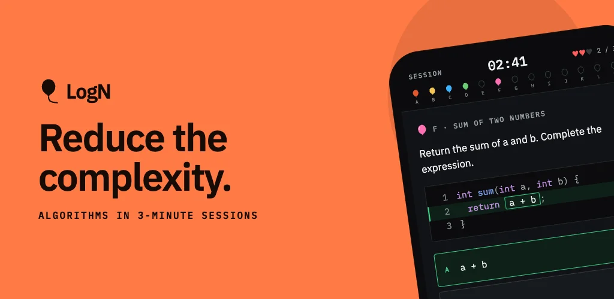
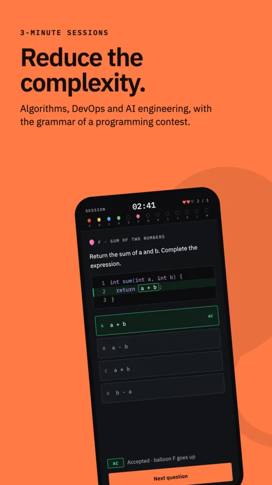
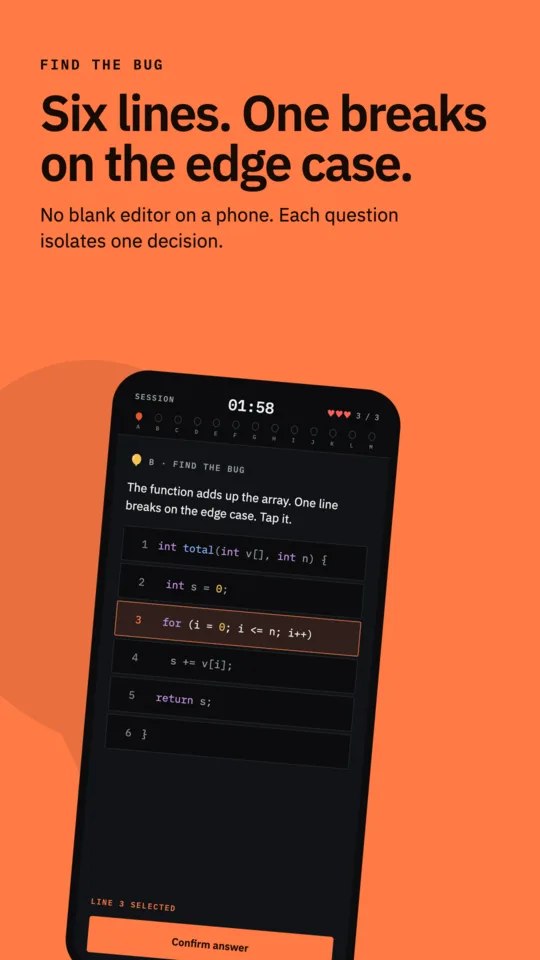
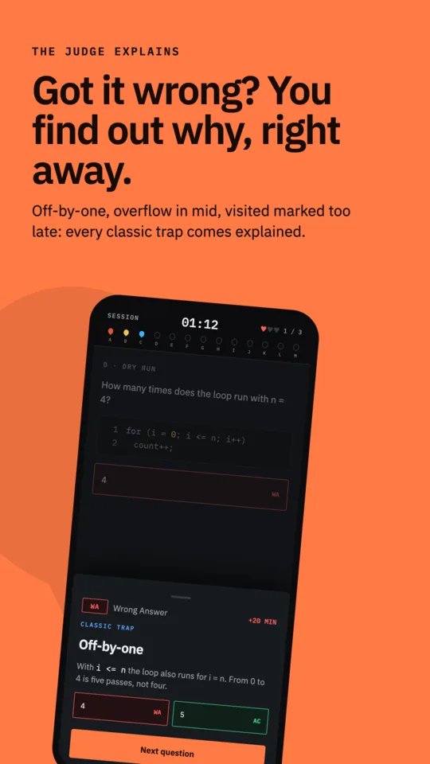
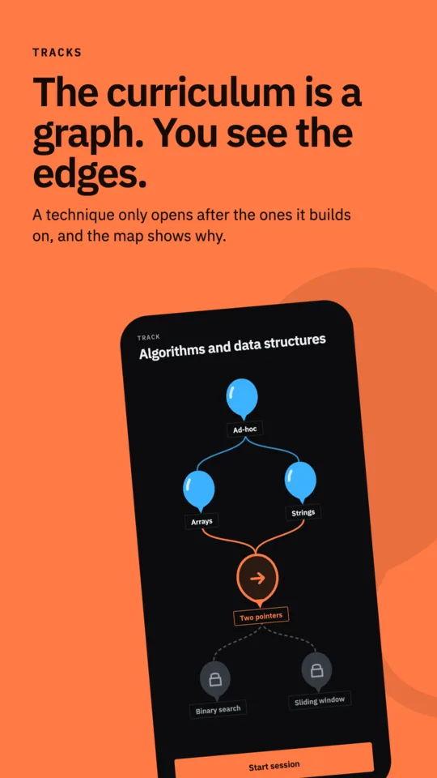
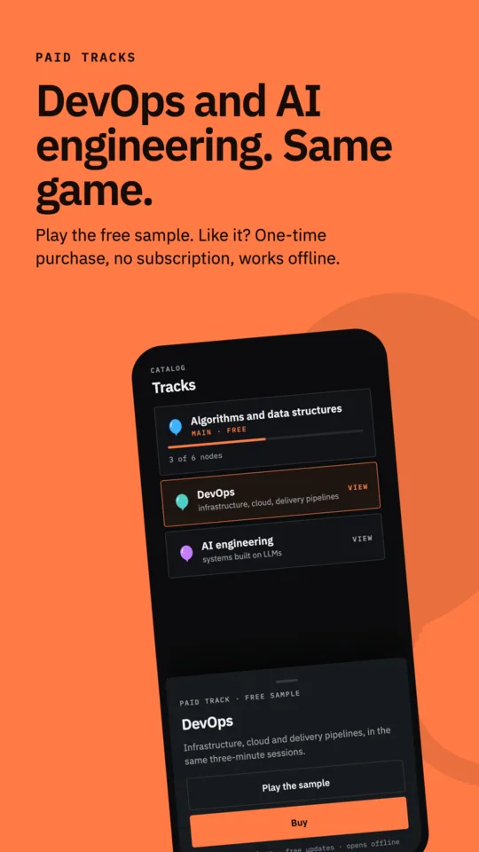
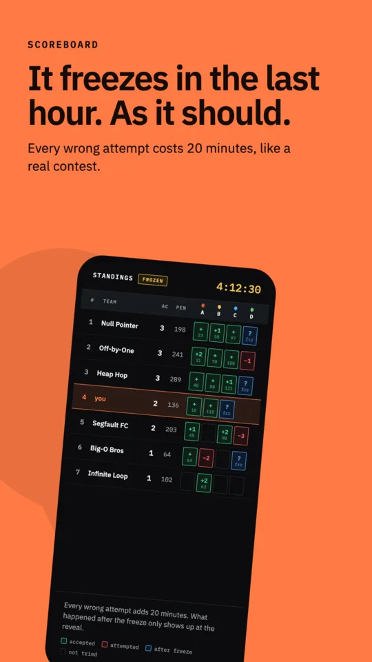

# LogN

**English** · [Português](README.pt-BR.md)

Competitive programming practice with the mechanics of a contest, on your phone.

It is not a video course or an exercise list. You join a match with three lives and a
clock, and every accepted answer raises a balloon: the ICPC metaphor, where a wrong
attempt costs a penalty and the scoreboard freezes near the end. A session takes minutes,
not an afternoon.

  
  
  

## How it works

**Tracks of topics** in programming, linked as a graph, not a list: a topic can open
more than one path, and paths can meet again further on. Each node opens with
accumulated XP, and XP comes from accepted answers. The curriculum itself (topics,
statements and answer keys) lives in the content repository.

**Six challenge formats**, because knowing how to program has different parts:

| format | what it measures |
|---|---|
| Find the bug | reading someone else's code and pinning the defect to one line |
| Fill in the blank | picking the right expression among plausible mistakes |
| Dry run | simulating the state step by step and predicting the result |
| Match the complexity | the two axes of complexity, time and space, kept apart |
| Weigh the trade-off | the cost of each approach, with sentences instead of O(n) |
| Tag the pattern | recognizing the technique that solves it, before writing code |

**Truly offline-first.** All the logic lives in a Rust core shared across platforms; the
client only draws. Answering without a network loses no progress: events go into a
hash-chained queue, and the server validates the chain instead of rewriting history.

**Mistakes teach.** Every wrong answer opens a card that explains what is wrong *in that
code*, not generic advice. It is the game's only feedback surface, and it is where the
work goes.

  
  
  

## Platforms

The launch is on **Android**, on Google Play ([ADR 0022](docs/architecture/decisions/0022-android-primeiro-no-lancamento.md)).
The iOS client shares the same core and comes to the App Store later; the waiting list is
on [logn.sh](https://logn.sh).

## Architecture

A three-layer monorepo. **Go + PostgreSQL** for sync, auth and persistence; challenges
live in a `JSONB` column with `CHECK CONSTRAINTS` that reject, at `INSERT` time, a
challenge with no possible answer. **Rust/Crux** is the mind: model, rules, match engine,
offline queue. **Jetpack Compose** and **SwiftUI** are dumb layers: they send events and
receive a view model. The bridge is bincode over native FFI, with generated types.

Structural decisions are in [`docs/architecture/decisions/`](docs/architecture/decisions/).

## The content is not here

This repository has the app; it does not have the track. Statements, answer keys and
explanations live elsewhere, and a clean clone brings up a backend with the right
structure and nothing to play.

The split is by nature: schema, constraints, judging engine and screens are engineering,
and they are all here. The curriculum is something else.

To run with your own content, write a migration that fills `skill_nodes` and
`challenges` in `backend/schema/migrations/`. The constraints tell you right away if a
challenge has no possible answer.

## License

Code under the **Apache License 2.0**; see [LICENSE](LICENSE). Use, modify and
redistribute it, commercially too.

**The LogN name, the symbol and the visual identity are not under that license.** A
derivative is welcome; it just needs another name and another look. Details in
[TRADEMARKS.md](TRADEMARKS.md), and third-party attributions, including
the IBM Plex fonts, which are OFL, in [NOTICE](NOTICE).
