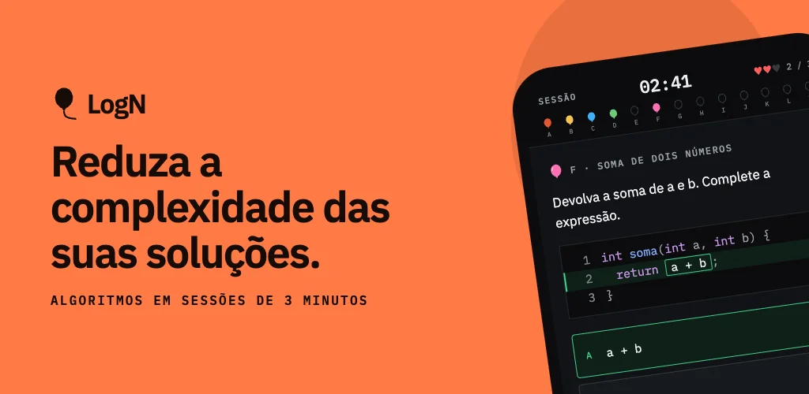
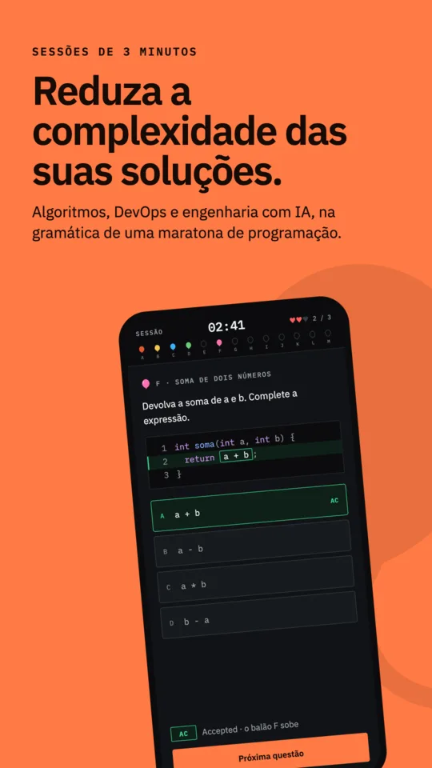
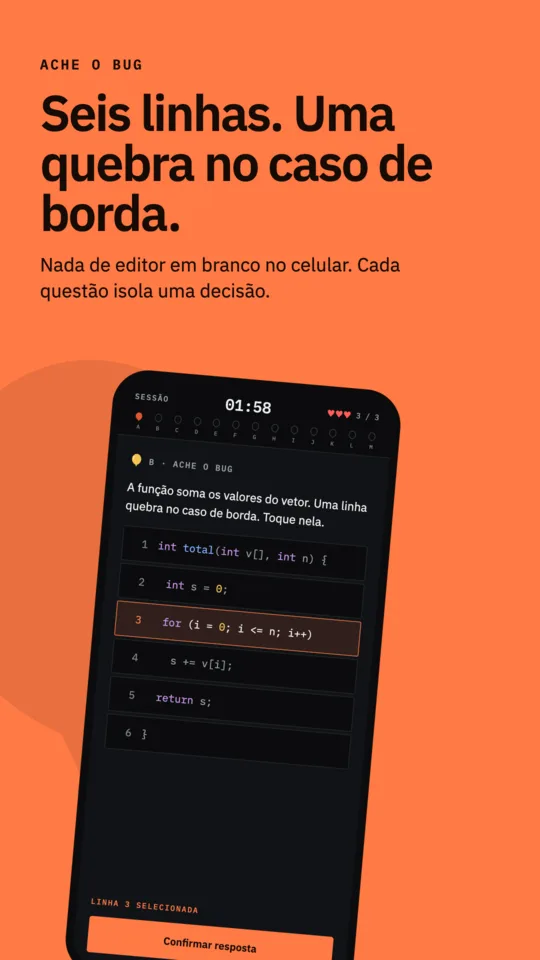
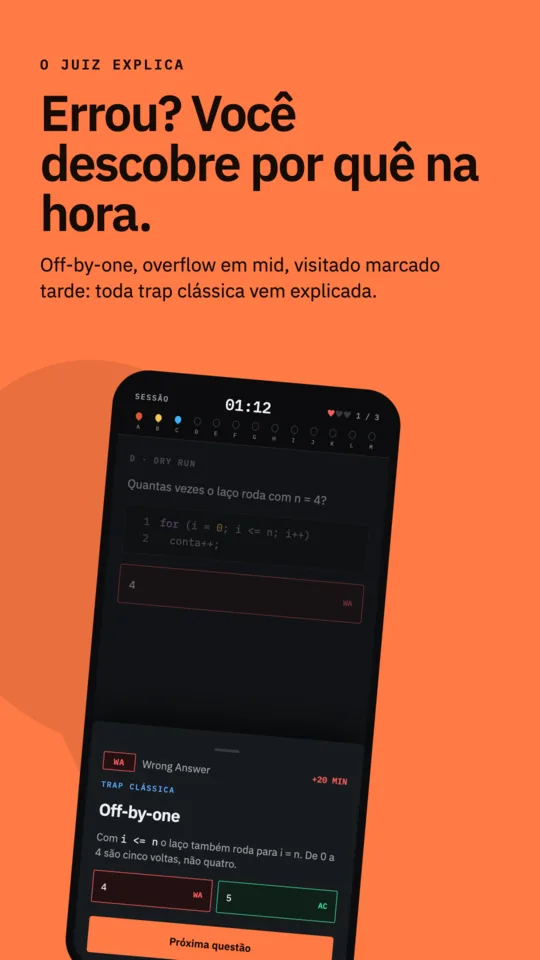
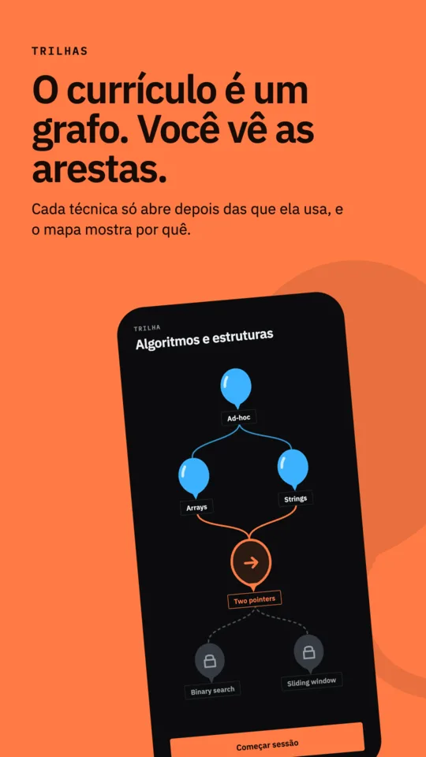
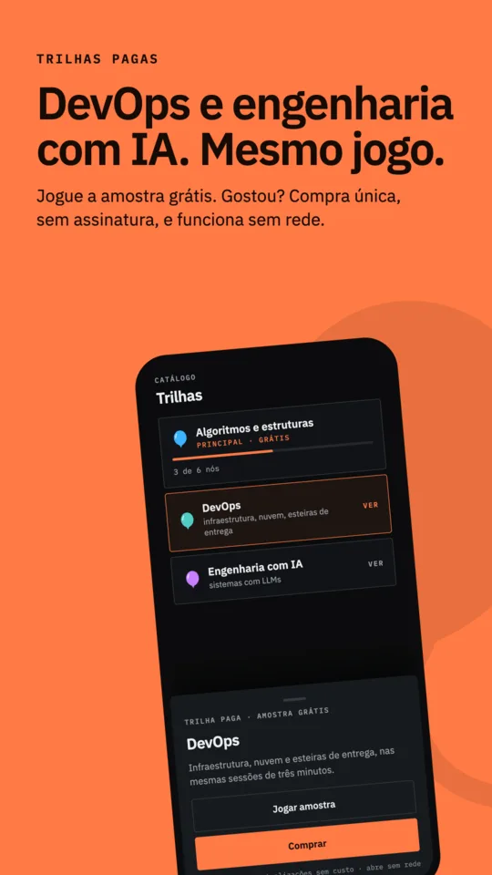
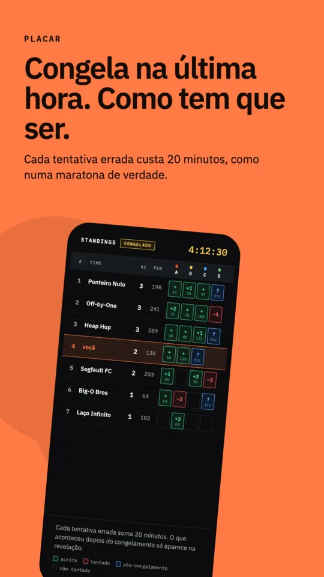

# LogN

[English](README.md) · **Português**

Treino de programação competitiva com a mecânica de um contest, no celular.

Não é videoaula nem lista de exercícios. Você entra numa partida, tem três vidas e um
relógio, e cada acerto sobe um balão — a metáfora da ICPC, onde errar custa penalidade e
o placar congela no fim. A sessão dura minutos, não uma tarde.

  
  
  

## Como funciona

**Trilhas de assuntos** de programação, ligados como grafo e não como lista: um assunto
pode abrir mais de um caminho, e caminhos podem voltar a se encontrar. Cada nó abre
com XP acumulado, e o XP entra por resposta aceita. O currículo em si — os assuntos,
enunciados e gabaritos — vive no repositório de conteúdo.

**Seis formatos de desafio**, porque saber programar tem partes diferentes:

| formato | o que mede |
|---|---|
| Ache o bug | ler código alheio e localizar o defeito numa linha |
| Complete a lacuna | escolher a expressão certa entre erros plausíveis |
| Trace a saída | simular o estado passo a passo e prever o resultado |
| Tempo e espaço | os dois eixos de complexidade, separados |
| Pese o trade-off | o custo de cada abordagem, com frases no lugar de O(n) |
| Marque o padrão | reconhecer a técnica que resolve, antes de escrever código |

**Offline-first de verdade.** A lógica inteira vive num núcleo em Rust compartilhado
entre plataformas; o cliente só desenha. Responder sem rede não perde progresso: os
eventos entram numa fila encadeada por hash, e o servidor valida a cadeia em vez de
reescrever o histórico.

**Erro ensina.** Toda resposta errada abre um cartão que explica o que está errado
*naquele código* — não conselho genérico. É a única superfície de feedback do jogo, e é
onde está o trabalho.

  
  
  

## Plataformas

O lançamento é no **Android**, pelo Google Play ([ADR 0022](docs/architecture/decisions/0022-android-primeiro-no-lancamento.pt-BR.md)).
O cliente iOS usa o mesmo núcleo e chega à App Store depois; a lista de espera fica em
[logn.sh](https://logn.sh).

## Arquitetura

Monorepo de três camadas. **Go + PostgreSQL** para sync, auth e persistência; os desafios
moram numa coluna `JSONB` com `CHECK CONSTRAINTS` que recusam desafio sem resposta
possível na hora do `INSERT`. **Rust/Crux** é a mente: modelo, regras, motor de partida,
fila offline. **Jetpack Compose** e **SwiftUI** são camadas burras — mandam evento,
recebem view model. A ponte é bincode via FFI nativa, com tipagem gerada.

Decisões estruturais estão em [`docs/architecture/decisions/`](docs/architecture/decisions/).

## O conteúdo não está aqui

Este repositório tem o app; não tem a trilha. Enunciados, gabaritos e explicações vivem
separados, e um clone limpo sobe um backend com a estrutura certa e nada para jogar.

A divisão é por natureza: schema, constraints, motor de julgamento e telas são
engenharia e estão todos aqui. O currículo é outra coisa.

Para rodar com conteúdo próprio, escreva uma migração que popule `skill_nodes` e
`challenges` em `backend/schema/migrations/`. As constraints avisam na hora se o desafio
não tem resposta possível.

## Licença

Código sob **Apache License 2.0** — ver [LICENSE](LICENSE). Use, modifique e
redistribua, inclusive comercialmente.

**O nome LogN, o símbolo e a identidade visual não estão nessa licença.** Um derivado é
bem-vindo; ele só precisa de outro nome e outra cara. Detalhes em
[TRADEMARKS.pt-BR.md](TRADEMARKS.pt-BR.md), e atribuições de terceiros — incluindo as
fontes IBM Plex, que são OFL — em [NOTICE.pt-BR](NOTICE.pt-BR).
